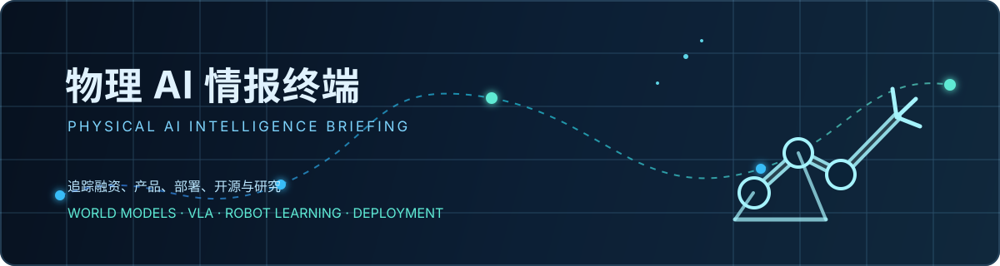

# 物理 AI 产业情报库

> 面向中文从业者：用可追溯事实理解公司、资本、技术路线与研究进展。

  <a href="#产业进展">产业进展</a> ·
  <a href="#公司与资本地图">公司与资本地图</a> ·
  <a href="#学术与研究前沿">学术与研究前沿</a> ·
  <a href="#技术竞争与研究">技术地图</a>

## 产业进展

<!-- EVENT_CENTER_START -->

- [Enigma融资7100万美元，让控制机器人像调节音量一样简单](https://techcrunch.com/2026/07/27/enigma-raises-70m-to-make-controlling-a-robot-as-easy-as-adjusting-the-volume/) <kbd>投融资</kbd> <kbd>部署与商业化</kbd> 08-01 Enigma完成7100万美元种子轮融资，由Index Ventures和Ribbit Capital领投，Sarah Guo的Conviction Partners参投，以简化机器人控制。

- [谷歌 DeepMind 推出 Gemini Robotics 2，强化自适应机器人能力](https://deepmind.google/blog/gemini-robotics-er-2-powering-robotics-with-video-understanding-task-orchestration-and-multi-robot-collaboration/) <kbd>产品发布</kbd> <kbd>VLA 与具身模型</kbd> 08-01 Gemini Robotics ER 2 可帮助机器人推理、协作并解决现实世界任务，在视频理解、工具编排与多机器人协作方面实现跨越式进步，面向机器人应用。

- [LeRobot v0.6.0 发布，默认依赖与强化学习接口调整](https://github.com/huggingface/lerobot/releases/tag/v0.6.0) <kbd>产品发布</kbd> <kbd>世界模型与空间智能</kbd> <kbd>VLA 与具身模型</kbd> 08-01 LeRobot v0.6.0 精简默认安装，数据集与训练依赖需按 extras 安装；导入路径调整，GR00T 升至 N1.7，PyTorch 至少 2.7，强化学习栈重建。

- [日本机器人与制造业领军企业基于NVIDIA Cosmos推进物理AI前沿](https://nvidianews.nvidia.com/news/japans-robotics-and-manufacturing-leaders-build-on-nvidia-cosmos-to-advance-physical-ai-frontier) <kbd>产品发布</kbd> <kbd>世界模型与空间智能</kbd> <kbd>部署与商业化</kbd> 08-01 英伟达宣布，日本物理AI领军企业正基于其Cosmos、Isaac、Metropolis和Jetson平台，加速在制造、出行、基础设施及机器人领域部署智能机器。

- [谷歌与AIM推出AI工具ATL Saathi，赋能印度新一代创新者](https://deepmind.google/blog/empowering-indias-next-generation-of-innovators-with-atl-saathi/) <kbd>产品发布</kbd> <kbd>部署与商业化</kbd> 08-01 谷歌与AIM联合推出由Gemini驱动的人工智能工具ATL Saathi，为印度机器人实验室中的教育工作者提供支持，助力培养该国下一代创新者。

- [意大利人形机器人GENE.01问世：六个月建成，全身覆盖多模态皮肤](https://spectrum.ieee.org/video-friday-physical-ai-robotics) <kbd>部署案例</kbd> <kbd>世界模型与空间智能</kbd> <kbd>本体与硬件</kbd> 08-01 意大利Generative Bionics发布人形机器人GENE.01：团队六个月建成，机器人可行走、感知与交互，全身多模态皮肤能感知触觉、接近、力和温度，助力安全自然的人机协作。

- [日本曾引领人形机器人，如今能否追赶中国？](https://spectrum.ieee.org/humanoid-robots-japan) <kbd>产品发布</kbd> <kbd>VLA 与具身模型</kbd> <kbd>本体与硬件</kbd> 08-01 东京人形机器人峰会上，中国机器人数量约为日本三倍，日本企业甚至以宇树G1做演示。日本虽曾造出首台人形机器人WABOT-1，却未将其商业化，如今须凭技术积淀追赶中国。

- [视频星期五：机器人的世界杯](https://spectrum.ieee.org/video-friday-robot-world-cup) <kbd>产品发布</kbd> <kbd>VLA 与具身模型</kbd> <kbd>本体与硬件</kbd> 08-01 本期汇集多项机器人进展：首次两支全尺寸人形机器人队进行11对11足球赛；MIT与EPFL研制可潜水再出水飞行的机器人；1X推出25自由度灵巧手；GEN-1模型将简单任务成功率提升至99%。

<!-- EVENT_CENTER_END -->

## 公司与资本地图

<!-- COMPANY_RADAR_START -->

### 融资与并购

- **Enigma** · [完成7100万美元融资](https://news.google.com/rss/articles/CBMihAFBVV95cUxONnQ3bkxfckoxd096Q1pEV3BQT3FIYktzRmYzS3E0VGVRS3JTWkZxVUNwbmZObVdGdHJrLXBwY09BN2hJb3AybFJiUVJ0djhHbENPY01jS3BSN01zU3JlOGU1ZE04eTBvNFV3MW1UaGRENGdUeElPeFNpRUM5clhMN2RveGXSAYQBQVVfeXFMTjZ0N25MX3JKMXdPekNaRFdwUE9xSGJLc0ZmM0txNFRlUUtyU1pGcVVDcG5mTm1XRnRyay1wcGNPQTdoSW9wMmxSYlFSdHY4R2xDT2NNY0twUjdNc1NyZThlNWRNOHkwbzRVdzFtVGhkRDRnVHhJT3hTaUVDOXJYTDdkb3hl?oc=5) · 2026-08-01
- **Axis Robotics** · [完成1200万美元融资](https://news.google.com/rss/articles/CBMiswFBVV95cUxNelg3cFFFUlpaZXJtTzhPNTNUMHdsYlRZN2VWcG5PNXRhT0xaZmh0cnRqZzNhTE4yRlZFWW11Nm1KT2ZiMWllWm9aQnU5X2tDTG84NVM2djZfanZCdFlZUV9VOUQ0VE8yZW5WWmZBVl9WYlRWVVN1TTd4b1o3cFJrQ0RCSjZTclNPVzUtbkQ0RndZSDVFdUh2MnhuaUdyd1ZZdTRhc3hfanZtM2t2SmVLNDg4cw?oc=5) · 2026-08-01
- **Holiday Robotics** · [完成1.05亿美元融资](https://news.google.com/rss/articles/CBMijAFBVV95cUxOVEh1SkFzV0JZeUNfUXd4N3dTd1pJTU9FcVdaampQSTI5ZVF5dWliYm5BdEhQVFI1RmZoRk9wVXFfUzBkUU9ONHd6LWFoTnhoQklfbWZXdHUxMTlpZ2pTOFNjbVBYZFlKX2UwRl9PUGlqMWlaUTVWOW44MjQ2V0c5cVlUbk9aa1FjLWlObA?oc=5) · 2026-08-01
- **Humanoid** · [Humanoid完成1.52亿美元融资，投后估值达13.5亿美元，成为欧洲首家专注人形机器人领域的独角兽企业](https://news.google.com/rss/articles/CBMilAJBVV95cUxNRXRPSWU4b3JVZm1fRFFhc3VqWmw1SFV4SGVqSXZ2ODRaaE5pUk1qb2FkaVp2c0RUU0pCaGZBbEt1aVM5d1VKUmNMSzd4VUFhanJya3BFMmVMZ3ZpN29lS3JzejJzZEh0aGVCS2pVVk1BTHJhTUtiaUNyWjVxY21YdlZuV1VPWjJ5X1A3dXEydEhuc0NWNlBNT2lIeFFmVnc0cDJMOUozQkFxalZvel9Tcy1rV3JjellIT19hTmVwNmlPWGFQa2ZCcjQ1TjQ1c2RBcHotRXpmdkVLUS1KRWFmalFWenFmcHdoRklhbEZCbmotTC1nclB3YUE2cWRBR2ZiTnhZbGdIWXZ0SjV3UmhzdFk2RE0?oc=5) · 2026-08-01
- **Hyperion Robotics** · [完成740万美元融资](https://news.google.com/rss/articles/CBMi4gFBVV95cUxOTmZXVEZEOTc5ZEQ3WnV0TFNmWDFtb2V1c05VUEk1TnFRUHFwTEpTbUEtTi1IQnRSRUpOci1Gdko4QVlvYURHeThXbXY4d0Z4b0FvNXNZcE8tQzFjeFlKeVpXaUlRYnJFZHJVcTJsMDBBamlYVzVxZ25mckYwUUJhM0VIc2tPTFVIdEdmV25sbXFEd0NxeDFKcklhWVUtU3FiNXZLZTdheDdpNmZnZ05INF8zOXBZamR4TXpkNDdCMTQtM1ZsNzY3Skp5ZGhkSFF2RWhnYWwyZy1GcENsNFpZbWpn?oc=5) · 2026-08-01

### 公司最新进展

- **Google DeepMind** · [谷歌 DeepMind 推出 Gemini Robotics 2，强化自适应机器人能力](https://deepmind.google/blog/gemini-robotics-er-2-powering-robotics-with-video-understanding-task-orchestration-and-multi-robot-collaboration/)：Gemini Robotics ER 2 可帮助机器人推理、协作并解决现实世界任务，在视频理解、工具编排与多机器人协作方面实现跨越式进步，面向机器人应用。
- **NVIDIA** · [日本机器人与制造业领军企业基于NVIDIA Cosmos推进物理AI前沿](https://nvidianews.nvidia.com/news/japans-robotics-and-manufacturing-leaders-build-on-nvidia-cosmos-to-advance-physical-ai-frontier)：英伟达宣布，日本物理AI领军企业正基于其Cosmos、Isaac、Metropolis和Jetson平台，加速在制造、出行、基础设施及机器人领域部署智能机器。
- **Agility Robotics** · [人形机器人公司Agility Robotics将借SPAC上市，CEO称短期内不会承诺机器人进入家庭](https://techcrunch.com/2026/07/05/this-humanoid-robotics-company-is-going-public-but-its-ceo-isnt-promising-a-robot-in-your-home-anytime-soon/)：Agility Robotics计划通过SPAC上市。与其他追逐高估值的人形机器人初创公司不同，该公司押注执行力，其CEO表示近期不会承诺让机器人走进家庭。
- **Agility Robotics** · [ 在特斯拉“后院”插上旗帜](https://techcrunch.com/2026/07/17/agility-robotics-plants-its-flag-in-teslas-backyard/)：机器人公司 Agility Robotics 正在美国加利福尼亚州弗里蒙特开设一座新的训练中心，专门用于训练其 Digit 机器人。

### 技术路线地图

| 路线 | 代表公司 |
| --- | --- |
| VLA 与具身模型 | [NVIDIA](https://www.nvidia.com/en-us/ai-robotics/) · [Google DeepMind](https://deepmind.google/) · [Meta](https://ai.meta.com/) · [Figure](https://www.figure.ai/) · [Physical Intelligence](https://www.physicalintelligence.company/) · [Sanctuary AI](https://www.sanctuary.ai/) · [Skild AI](https://www.skild.ai/) · [Dexterity](https://www.dexterity.ai/) |
| 世界模型与空间智能 | [NVIDIA](https://www.nvidia.com/en-us/ai-robotics/) · [World Labs](https://www.worldlabs.ai/) |
| 本体与硬件 | [Tesla](https://www.tesla.com/AI) · [Figure](https://www.figure.ai/) · [1X](https://www.1x.tech/) · [Apptronik](https://apptronik.com/) · [Agility Robotics](https://agilityrobotics.com/) · [Sanctuary AI](https://www.sanctuary.ai/) · [Boston Dynamics](https://bostondynamics.com/) · [宇树科技](https://www.unitree.com/) |
| 数据与训练 | [Tesla](https://www.tesla.com/AI) · [NVIDIA](https://www.nvidia.com/en-us/ai-robotics/) · [Google DeepMind](https://deepmind.google/) · [Meta](https://ai.meta.com/) · [Physical Intelligence](https://www.physicalintelligence.company/) · [Skild AI](https://www.skild.ai/) · [宇树科技](https://www.unitree.com/) |
| 部署与商业化 | [Tesla](https://www.tesla.com/AI) · [Figure](https://www.figure.ai/) · [1X](https://www.1x.tech/) · [Apptronik](https://apptronik.com/) · [Agility Robotics](https://agilityrobotics.com/) · [Dexterity](https://www.dexterity.ai/) · [Boston Dynamics](https://bostondynamics.com/) · [优必选](https://www.ubtrobot.com/) |

<!-- COMPANY_RADAR_END -->

## 学术与研究前沿

<!-- RESEARCH_UPDATES_START -->

- [物理 AI 研究论文](https://arxiv.org/abs/2607.28451v1) <kbd>论文</kbd> <kbd>产品</kbd> <kbd>robot</kbd> 07-30 已收录论文原文，中文事实简介将在更新后补齐。

- [物理 AI 研究论文](https://arxiv.org/abs/2607.27881v1) <kbd>论文</kbd> <kbd>落地</kbd> <kbd>robot</kbd> 07-30 已收录论文原文，中文事实简介将在更新后补齐。

- [物理 AI 研究论文](https://arxiv.org/abs/2607.27782v1) <kbd>论文</kbd> <kbd>落地</kbd> <kbd>robot</kbd> 07-30 已收录论文原文，中文事实简介将在更新后补齐。

- [物理 AI 研究论文](https://arxiv.org/abs/2607.26809v1) <kbd>论文</kbd> <kbd>产业</kbd> <kbd>robot</kbd> 07-29 已收录论文原文，中文事实简介将在更新后补齐。

- [物理 AI 研究论文](https://arxiv.org/abs/2607.26789v1) <kbd>论文</kbd> <kbd>落地</kbd> <kbd>vla</kbd> 07-29 已收录论文原文，中文事实简介将在更新后补齐。

- [物理 AI 研究论文](https://arxiv.org/abs/2607.26513v1) <kbd>论文</kbd> <kbd>产业</kbd> <kbd>vla</kbd> 07-29 已收录论文原文，中文事实简介将在更新后补齐。

<!-- RESEARCH_UPDATES_END -->

## 技术竞争与研究

| 你要判断什么 | 从这里进入 |
| --- | --- |
| 哪条技术路线正在获得公司与资本支持 | [产业地图与技术路线](resources/industry-landscape-and-tech-routes.md) |
| 里程碑论文、技术脉络与精读 | [业界里程碑论文与精读](resources/milestone-papers.md) |
| 模型、代码、数据与基准 | [模型与开源项目](resources/models-and-open-source.md) · [数据集与基准](resources/datasets-and-benchmarks.md) |
| 仿真、训练与部署工具 | [仿真与工具](resources/simulation-and-tools.md) |
| 奠基视频、演讲与博客 | [奠基视频、演讲与博客](resources/foundational-talks-and-blogs.md) |
